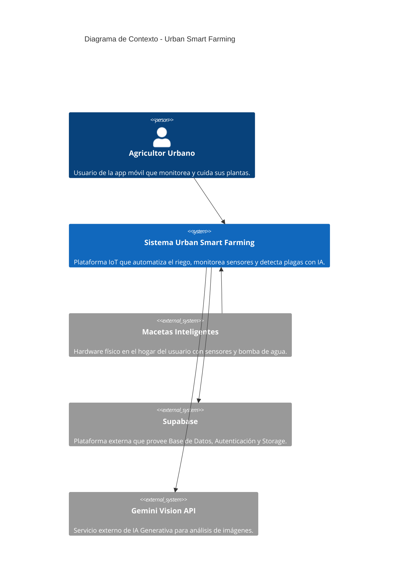
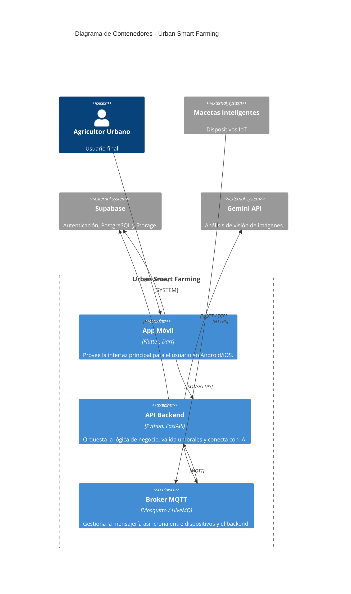
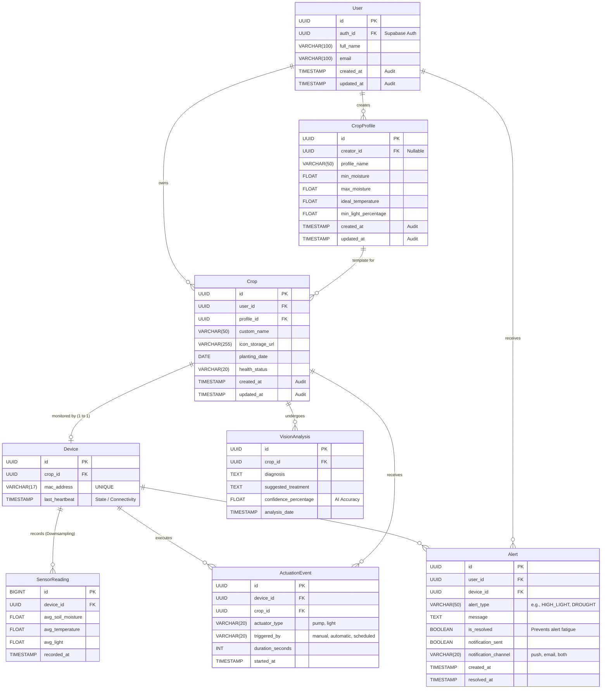

# Documento de Descripción de Arquitectura de Software (SADD)

## Proyecto: Urban Smart Farming (USF)

**Fecha:** Marzo 2026

## 1. Introducción y Contexto

### Propósito del Sistema y Objetivos Principales

"Urban Smart Farming" es un sistema distribuido IoT diseñado para automatizar el monitoreo y la optimización de las condiciones de crecimiento de plantas en entornos urbanos. El objetivo principal es reducir la mortalidad de las plantas y optimizar el uso de recursos (agua, luz) mediante hardware de detección, actuación automatizada e Inteligencia Artificial.

Al tratar con elementos del mundo físico (agua, electricidad) y redes inestables (Wi-Fi doméstico), el sistema está diseñado con un fuerte enfoque en la **resiliencia y la minimización de datos**, garantizando la seguridad del hogar del usuario incluso en escenarios de desconexión.

### Descripción de los Stakeholders

* **Usuarios Finales (Agricultores Urbanos):** Monitorean sus plantas, reciben alertas tempranas de plagas y controlan el sistema vía App (Flutter).
* **Desarrolladores / Administradores:** Mantienen la infraestructura (Backend Python, Supabase, Broker MQTT) y gestionan el catálogo de perfiles base.
* **Dispositivos Edge (Macetas Inteligentes):** Microcontroladores que generan telemetría de alta frecuencia y ejecutan rutinas locales de seguridad.

## 2. Decisiones de Arquitectura (ADR)

### Estilo Arquitectónico Seleccionado

Se ha elegido una **Arquitectura Distribuida Cloud-Edge (Microservicios Híbridos)**.

* **Justificación:** El sistema requiere manejar procesos asíncronos de alta frecuencia (telemetría IoT) separados de las peticiones síncronas de los usuarios (API HTTP). Utilizar un monolito tradicional saturaría el servidor. Separar las responsabilidades en la nube (BaaS para persistencia, Backend dedicado para IA/lógica y Broker MQTT para mensajería) garantiza escalabilidad, cumplimiento de tiempos de respuesta (RNF02) y tolerancia a fallos.

### ADR 1: Uso de Backend-as-a-Service (BaaS)

* **Contexto:** El proyecto tiene un tiempo de desarrollo limitado. Implementar gestión de usuarios, seguridad JWT y almacenamiento de archivos desde cero en Python consume demasiado tiempo.

* **Decisión:** Se adopta **Supabase** como plataforma BaaS primaria.

* **Consecuencias:**

  * *Positivas:* Acelera drásticamente el desarrollo de Auth y Storage. Delega la administración de la base de datos PostgreSQL.

  * *Negativas:* Introduce acoplamiento (Vendor Lock-in) a las librerías específicas de Supabase en el frontend y backend.

### ADR 2: Protocolo de Mensajería para IoT

* **Contexto:** Las macetas necesitan enviar datos de sensores (humedad, temperatura) constantemente y recibir órdenes de encendido de bombas de agua casi en tiempo real.

* **Decisión:** Se utilizará **MQTT** sobre un Broker en la nube en lugar de HTTP Polling.

* **Consecuencias:**

  * *Positivas:* Menor consumo de ancho de banda y batería en el hardware. Tiempos de latencia mínimos gracias al patrón de publicación/suscripción.

  * *Negativas:* Requiere mantener un componente extra en la infraestructura (el Broker MQTT) y manejar flujos asíncronos en el backend de Python.

## 3. Patrones de Diseño (GoF)

Para resolver problemas específicos de diseño de software en la capa de aplicación, se han implementado los siguientes patrones:

1. **Observer (Patrón Observador - Variante Pub/Sub):**

   * *Contexto:* Implementado a nivel de arquitectura y código mediante el `MqttHandlerService`.

   * *Problema:* El backend necesita reaccionar inmediatamente cuando una maceta cambia su estado de humedad, sin estar preguntándole constantemente.

   * *Solución:* El backend actúa como "Observador" suscribiéndose a los tópicos MQTT del dispositivo. Cuando el hardware publica un dato, el evento dispara asíncronamente la validación de umbrales y registro en la base de datos.

2. **Facade (Fachada):**

   * *Contexto:* Utilizado en el `VisionController` y `GeminiVisionService` del backend en Python.

   * *Problema:* Consultar una IA de terceros requiere formatear headers, codificar imágenes en Base64, parsear respuestas complejas en JSON y manejar reintentos de red. La capa de presentación no debe lidiar con esto.

   * *Solución:* El backend proporciona una "Fachada" simple (un endpoint POST `/api/vision/analizar`). Flutter solo envía la foto y el ID del cultivo; la Fachada orquesta la llamada a Gemini, extrae el texto útil, lo guarda en Supabase y devuelve una respuesta limpia al móvil.

3. **Singleton (Instancia Única):**

   * *Contexto:* Utilizado para gestionar las conexiones a servicios externos (`SupabaseClient` y `MQTTClient`).

   * *Problema:* Crear una nueva conexión a la base de datos o al broker MQTT por cada petición HTTP que llega al backend agotaría rápidamente los puertos y recursos del servidor.

   * *Solución:* Se garantiza la creación de una única instancia de los clientes de conexión durante el ciclo de vida de la aplicación FastAPI, compartiéndose de forma segura entre todos los controladores.

## 4. Diseño de Alto Nivel (Modelo C4)

A continuación, se presentan los diagramas de arquitectura utilizando la notación C4 (Contexto y Contenedores) integrados mediante Mermaid.js.

### 4.1 Nivel 1: Diagrama de Contexto

Muestra el sistema en su totalidad y cómo interactúa con el mundo exterior.

### 4.2 Nivel 2: Diagrama de Contenedores

Abre la "caja" del sistema USF para mostrar sus contenedores internos (Aplicaciones y APIs).

## 5. Vista de Datos (Modelo de Persistencia)

La base de datos relacional (PostgreSQL en Supabase) aísla el catálogo general de los registros específicos de los usuarios.

## 6. Estrategia de Resiliencia y Tolerancia a Fallos

En un ecosistema IoT distribuido, la resiliencia es vital para garantizar la integridad del mundo físico.

1. **Hardware: Watchdog y Temporizadores de Seguridad (Fail-Safe):**
   * *Riesgo:* Desconexión de Wi-Fi de la maceta mientras la bomba de agua recibe la orden de "Encender".
   * *Mitigación:* Todo actuador crítico implementa un temporizador local en el ESP32. Si el actuador (bomba) se enciende por un comando de la nube, un hilo paralelo en C++ lo apagará incondicionalmente después de "X" segundos, incluso si no recibe un comando de apagado, previniendo inundaciones locales.
2. **Red: Pérdida de Conexión del Dispositivo:**
   * *Mitigación:* Si el ESP32 pierde conexión con el Broker MQTT, guardará las últimas 10 lecturas en un buffer circular en su memoria RAM local y las transmitirá en "ráfaga" una vez restaurada la red (QoS 1).
3. **Dependencias Externas: Falla de la API de Gemini:**
   * *Mitigación:* Si la API de visión no responde (Timeout), el backend en Python capturará la excepción HTTP y retornará un código de estado gracefully gestionado (Ej. HTTP 503) a Flutter, quien mostrará un diálogo amigable recomendando "Intentar más tarde" en lugar de bloquear la UI.

## 7. Vista de Seguridad Completa

El sistema garantiza la triada CIA (Confidencialidad, Integridad y Disponibilidad) mediante defensas en profundidad:

1. **Seguridad Usuario-Nube (Capa HTTP):**
   * Autenticación manejada 100% por Supabase.
   * Las peticiones al backend en FastAPI deben incluir un **Bearer Token (JWT)** en las cabeceras. Un *Middleware* en Python valida la firma del token antes de ejecutar cualquier lógica (cumple RNF01).
2. **Seguridad Hardware-Nube (Capa MQTT):**
   * **Encriptación en Tránsito:** Las macetas se conectan al Broker usando **MQTTS (MQTT sobre TLS en el puerto 8883)**, asegurando que nadie pueda interceptar (sniffear) los comandos del hogar en la red pública.
   * **Listas de Control de Acceso (ACLs):** Cada ESP32 tiene un certificado o usuario único en el Broker que *únicamente* le permite publicar y suscribirse a su propia jerarquía de tópicos (`usf/telemetria/{mac_address}`). Se bloquea por arquitectura que una maceta controle los actuadores de un usuario ajeno.

## 8. Infraestructura y Despliegue

### Stack Tecnológico

* **Frontend (Capa de Presentación):** Flutter (Dart) compilado nativamente para iOS y Android.

* **Backend (Capa de Aplicación):** Python 3.10+ utilizando el framework FastAPI (por su alto rendimiento y soporte nativo asíncrono, ideal para convivir con MQTT).

* **Persistencia (BaaS):** Supabase alojado en la nube (provee base de datos PostgreSQL, Auth y S3-compatible Storage).

* **Mensajería IoT:** Un broker MQTT en la nube (ej. HiveMQ Cloud Serverless o EMQX) para aislar la gestión de red de los contenedores de aplicación.

* **Hardware:** Microcontroladores programados en C++ con soporte Wi-Fi integrado.

### Estrategia de CI/CD (Integración y Despliegue Continuos)

Para asegurar la calidad y rapidez en el ciclo de vida del desarrollo:

1. **Integración Continua (CI):** Se configurarán GitHub Actions. Cada *Pull Request* al repositorio del Backend ejecutará automáticamente linters y pruebas unitarias para validar la lógica de los controladores y servicios.

2. **Despliegue Continuo (CD):** Al hacer *merge* a la rama `main`, una Action empaquetará la aplicación FastAPI en un contenedor Docker y la desplegará automáticamente en un proveedor PaaS como Render o Railway.

3. **Gestión de Secretos:** Las llaves críticas (API Key de Gemini, contraseñas de Base de Datos y certificados MQTT) se inyectarán dinámicamente en el entorno de producción mediante las Variables de Entorno del PaaS, cumpliendo estrictamente con el RNF03 (Seguridad).